# Morphable Eyewear: Skeleton–Cage Deformation Framework

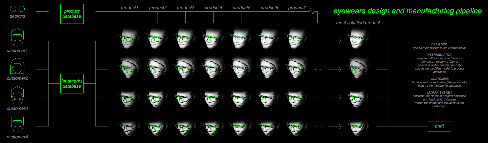

## Overview
This project presents a skeleton–cage-based geometric deformation method for combined rigid and non-rigid shape transformation with topology preservation.

## Code Availability
Due to NDA restrictions, the source code is not publicly available. This repository provides method descriptions and results only.

## Copyright
© 2026 All rights reserved. No part of this work may be reproduced or distributed without prior written permission.

## Method
The pipeline constructs an original deformation system by combining these techniques:
- Extracting projected geometry outlines
- Control cage generation
- Skeletal skinning (Linear Blend)
- Cage-based deformation (Mean Value Coordinates)  
- Landmark-guided deformation
  
## 1. 3D Face Data Preparation
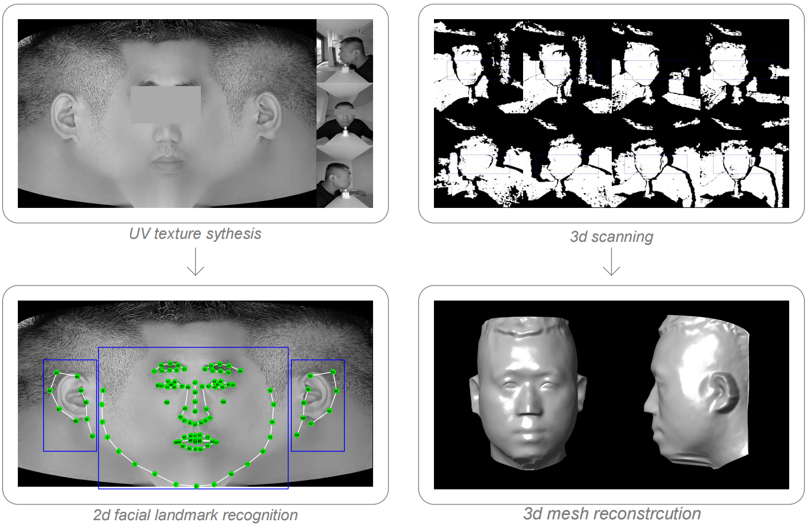
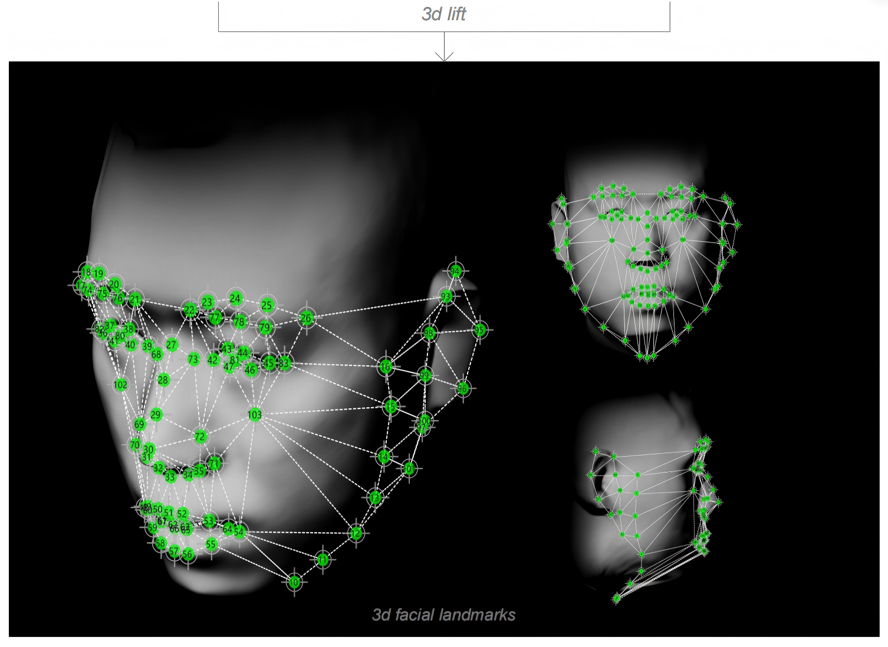

## 2. Eyewear Frame Data Preparation

Frames can be segmented into different material regions, each requiring distinct deformation behaviors to match facial anatomy. Different transformation method should be applied to each region to ensure manufacturability.

  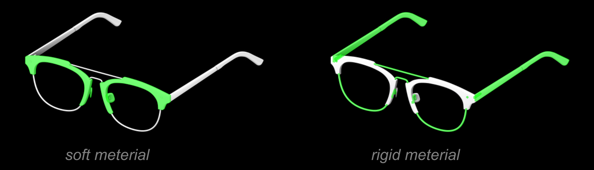 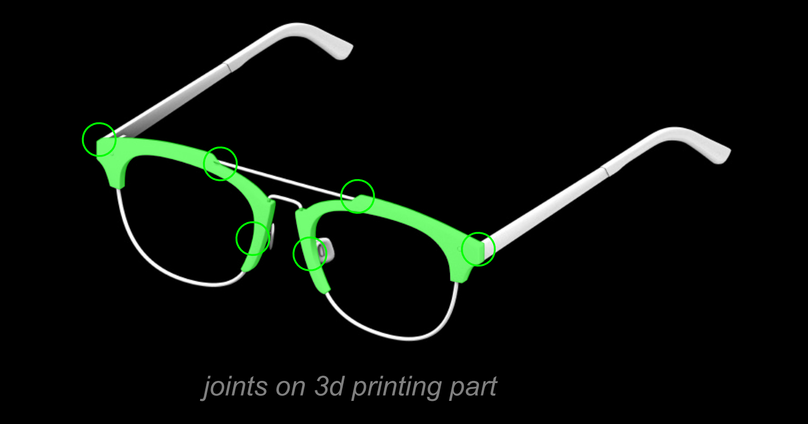

- ***SOFT REGIONS***:  refer to flexible materials, such as 3D-printed nylon, which can undergo continuous geometric deformation and twisting.

- ***RIGID REGIONS***:  refer to traditionally prefabricated components with fixed geometry that should remain undeformed during adaptation.

- ***JOINT REGIONS***:  are transitional structures that connect soft and rigid components, such as assembly holes. Although located within deformable areas, these regions must preserve their original geometry to maintain structural compatibility and assembly accuracy.

## Mesh Deformation: Skeleton-cage Method
The eyewear frame morphing system employs an original *skeleton-cage method* specifically designed for geometric deformation scenarios where both soft and rigid transformations coexist. It enables strict joint matching and smoothly blended shape morphing, ensuring both accurate articulation and natural transitional deformations.

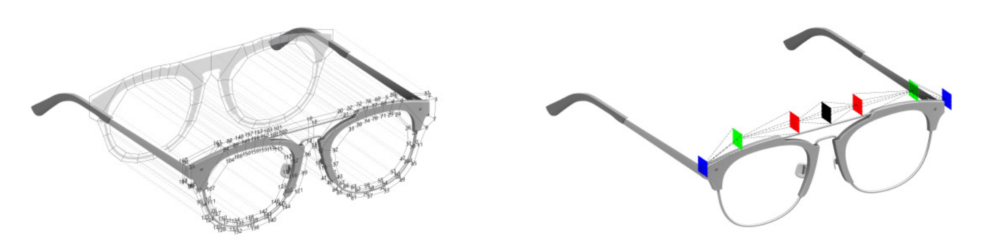

- ***CAGE*** :  Controller mesh generated from 2d frame projection, suitable for soft morphing.

Cage based deformation using mean value coordinates (MVC). *Reference:* [Ju, T., Schaefer, S., & Warren, J., 2005](https://people.engr.tamu.edu/schaefer/research/meanvalue.pdf)

- ***SKELETON*** :  Extracted heirarchical planes from ***CAGE*** vertices, suitable for rigid morphing.

Skeleton based deformation using Linear Blend Skinning (LBS). *Reference:* [Kavan et al., 2007](https://users.cs.utah.edu/~ladislav/kavan07skinning/kavan07skinning.pdf)

- ***VERTEX SHADING*** :  ARGB or CMYK channels where values indicate the weighted coordinates relative to ***CAGE*** and ***SKELETON***

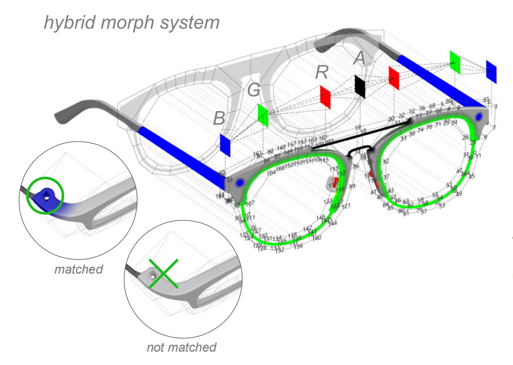
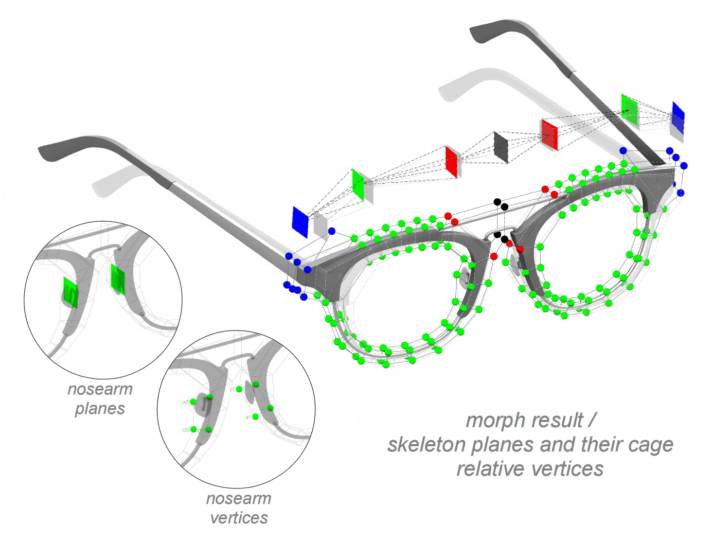

In this case: 

0: Cage morph.

A=255: Transform with skeleton node 1.

R=255: Transform with skeleton node 2.

G=255: Transform with skeleton node 3.

B=255: Transform with skeleton node 4.

0-255: Interpolate by weight.

## 3. Automated Cage Generation on Frame

  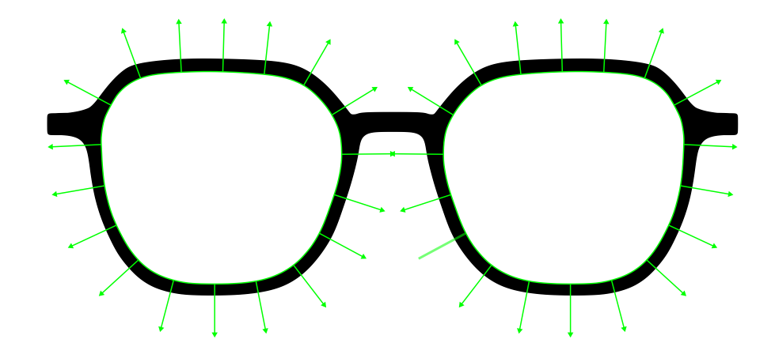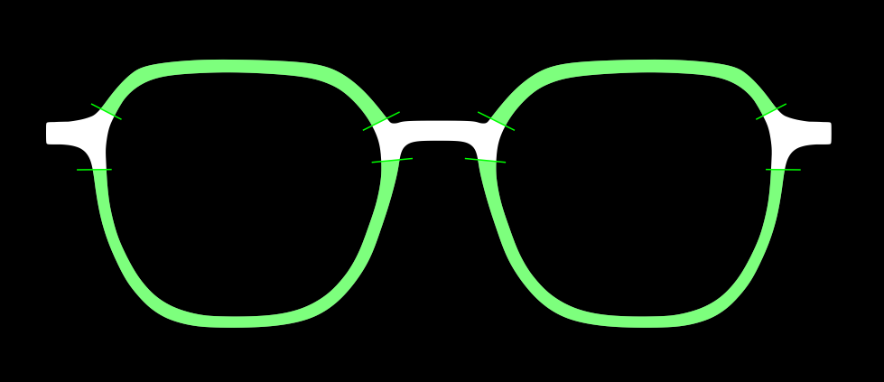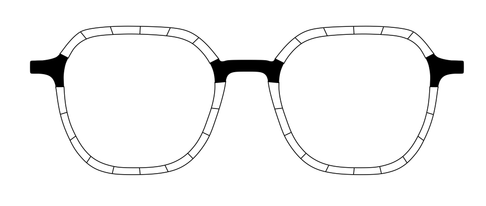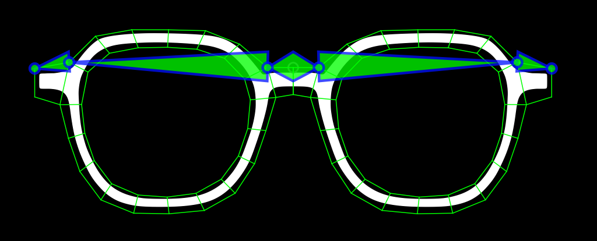

1. We first extract the 2D projected outlines of both the lenses and the frame from the input model. Sensor rays are then emitted from each point along the lens outlines toward the frame outline, terminating once they intersect the frame boundary.

2. The collection of rays within a specified distance threshold forms a set of regions, while their corresponding intersection points define characteristic curves. These regions and curves allow us to identify and distinguish structural components such as the bridge and endpieces.

3. After determining the regions, the outlines are segmented and transected in a predefined order. This process ensures topological consistency and prevents the generation of mismatched or inconsistent topologies during deformation.

4. The transection lines are then slightly scaled to construct a 2D cage structure. This 2D cage is subsequently reprojected onto the frame geometry, where the intersection bounding domains are computed to extrude the cage into a 3D representation. Finally, a skeleton structure is extracted from the generated 3D cage.

## 4. Automated Cage  Morphing to Face

The skeleton–cage structure is subsequently positioned and deformed using 3D facial landmarks. The figure below illustrates how the geometry is transformed under the influence of landmark constraints.

***The deformation logic :   Landmarks ----> Skeleton ----> Cage ----> Mesh***

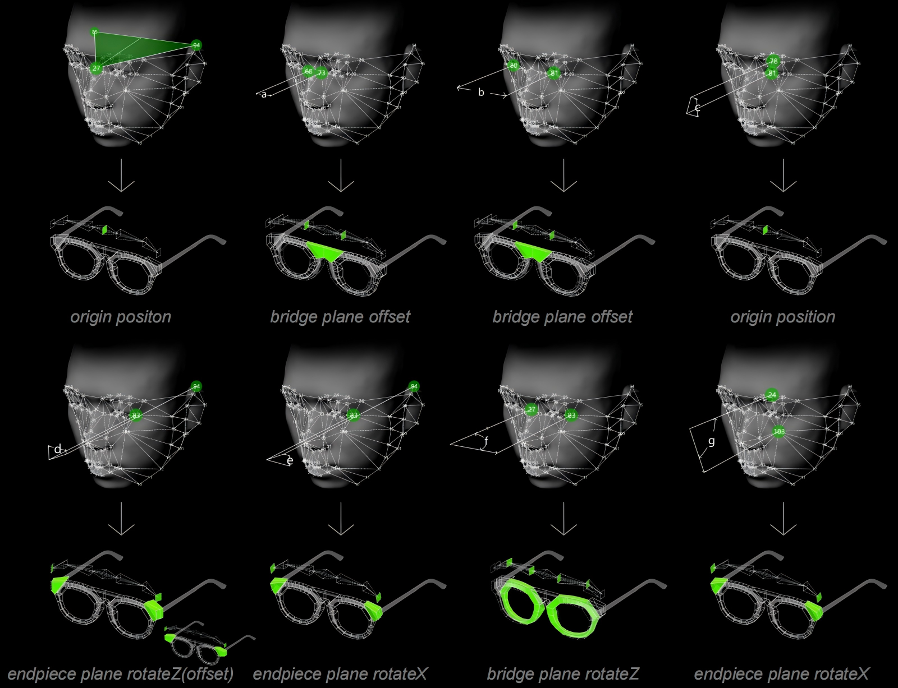

The deformation is later adjusted according to a fitting plan provided by ophthalmic specialists, which serves as a clinical guideline for achieving proper alignment with the wearer’s facial anatomy. 

- ***EULER ANGLE ARTIFACT*** :  Two rotations are applied to each endpiece. To avoid order-dependent artifacts from Eular angles, we decouple the transformations by applying rotateZ in the local coordinate system and rotateX in the world coordinate system. This ensures the two rotations remain independent and removes ambiguity caused by rotation order

## 5. Visualization on Face
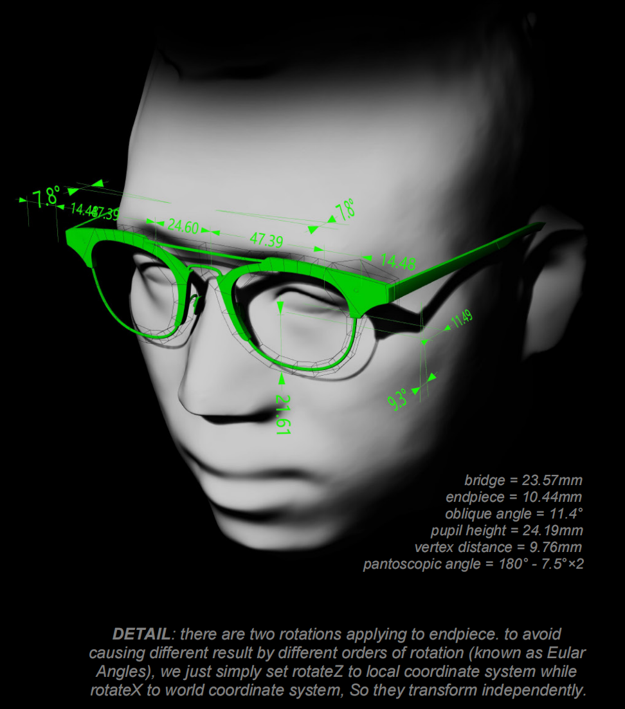
